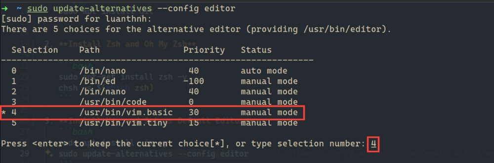

# Customizing Ubuntu

## This guide provides step-by-step instructions for customizing your Ubuntu system.

## Prerequisites

Ensure you have sudo privileges to execute the following commands.

---

## Step 1: Install Essential Tools

1. **Install Git**

   ```bash
   sudo apt install git
   ```

2. **Install Zsh and Oh My Zsh**

   ```bash
   sudo apt-get install zsh -y
   chsh -s $(which zsh)
   sudo curl -L http://install.ohmyz.sh | sh
   ```

3. **Install Vim and Set as Default Editor**

   ```bash
   sudo apt install vim -y
   sudo update-alternatives --config editor
   ```

   

   ```

   ```

4. **Install Docker and Set without sudo**

   - **Add Docker's official GPG key:**

   ```bash
   sudo apt-get update
   sudo apt-get install ca-certificates curl
   sudo install -m 0755 -d /etc/apt/keyrings
   sudo curl -fsSL https://download.docker.com/linux/ubuntu/gpg -o /etc/apt/keyrings/docker.asc
   sudo chmod a+r /etc/apt/keyrings/docker.asc
   ```

   - **Add the repository to Apt sources:**

   ```bash
   echo \
     "deb [arch=$(dpkg --print-architecture) signed-by=/etc/apt/keyrings/docker.asc] https://download.docker.com/linux/ubuntu \
     $(. /etc/os-release && echo "${UBUNTU_CODENAME:-$VERSION_CODENAME}") stable" | \
     sudo tee /etc/apt/sources.list.d/docker.list > /dev/null
   sudo apt-get update
   ```

   - **Install the Docker packages.**

   ```bash
   sudo apt-get install docker-ce docker-ce-cli containerd.io docker-buildx-plugin docker-compose-plugin
   sudo docker run hello-world
   ```

   - **Manage Docker as a non-root user**

   ```bash
   sudo groupadd docker
   sudo usermod -aG docker $USER
   newgrp docker
   docker run hello-world
   ```

## Step 2: Install and Apply Orchis Theme

1. Install dependencies:

   ```bash
   sudo apt install curl
   sudo apt install gnome-tweaks
   sudo apt install gnome-shell-extension-manager -y
   ```

2. Install theme Orchis Theme repository:

   ```bash
   cd ubuntu
   cp -r ./GTK-Themes/* $HOME/.themes
   ln -sf $HOME/.themes/Orchis-Dark/gtk-4.0/{assets,gtk.css,gtk-dark.css} $HOME/.config/gtk-4.0
   cp -r ./icon-themes/* $HOME/.local/share/icons
   cp -r ./cursors-theme/* $HOME/.icons
   cp -r ./cursors-theme/* $HOME/.icons
   cp -r ./zsh-configure/.oh-my-zsh $HOME/
   cp -r ./zsh-configure/.zshrc $HOME/
   dconf load / < ./settings.conf
   ```

3. Install shotwell & Setup backgrounds

   ```bash
   sudo snap install shotwell
   ```

   Download background [here](https://drive.google.com/drive/folders/16mAig-mI5gb552NP-QDh-2GRclUJicRW?usp=sharing)

---

## Step 3: Additional Utilities

1. **Install Common Utilities**

   ```bash
   sudo apt install nautilus-admin
   sudo apt install nautilus-extension-gnome-terminal
   ```

2. **Install IBus-Unikey for Vietnamese Input**

   ```bash
   sudo apt-get install ibus-unikey
   ```

   

3. **Install Audio Tools**
   ```bash
   sudo apt install pulseaudio
   sudo apt install pavucontrol
   ```

## Step 4: Final System Update

- After making all customizations, ensure your system is up-to-date:

  ```bash
  sudo apt update && sudo apt upgrade -y
  ```

<video controls width="600">
  <source src="https://github.com/luan-thnh/ubuntu/blob/main/assets/videos/shotwell.webm" type="video/webm">
  Your browser does not support the video tag.
</video>

---

## Notes

- Explore additional settings with **Gnome Tweaks** and **Gnome Shell Extension Manager**.
- Use `man` pages or official documentation to learn more about each tool.
